# Production ML Service: Semantic Search with Evaluation and Observability

[](https://github.com/prashanth1276/production-ml-service/actions)
[](https://www.python.org/)
[](https://www.docker.com/)
[](LICENSE)

A production-shaped ML service that serves semantic product recommendations via
FAISS vector search, with Redis caching, Prometheus metrics, structured logging,
optional API-key authentication, and a backend-agnostic LLM integration layer.

---

## Overview

This project answers a question most teams shipping LLM-powered services can't:
**how do you know your retrieval is actually good, and how does it behave under load?**

It combines:

- **FastAPI** backend with three endpoints: recommendations, chat, description generation
- **FAISS + sentence-transformers** for semantic search over a product catalog
- **Redis** for embedding and query caching
- **MongoDB** for the product and user store
- **Backend-agnostic LLM integration** — mock, Groq cloud, or self-hosted (llama.cpp / vLLM)
- **Prometheus** metrics exposed at `/metrics`
- **Structured JSON logging** with request IDs for tracing
- **Optional API-key authentication** on `/api/*` endpoints
- **Docker Compose** stack (web, mongo, redis, prometheus, grafana)
- **GitHub Actions CI** running tests, Docker image builds, and a full-stack Docker Compose smoke test on every push
- **An evaluation harness** measuring retrieval quality, latency, cache effectiveness, retrieval ablation, and load behavior under concurrency

---

## Evaluation Results

### Retrieval Quality (15 labeled queries)

| Config | NDCG@5 | Precision@5 | Recall@5 | MRR |
|---|---|---|---|---|
| **Baseline** (raw query) | **0.895** | 0.347 | **0.922** | **0.933** |
| User-context-augmented | 0.675 | 0.267 | 0.744 | 0.689 |

**Finding:** Naively appending user purchase history to the query *degrades*
retrieval (NDCG drops by 22 points). User context is not always relevant — a
gated approach that injects context only when the query semantically matches
user interests is left as future work.

### Latency Profile (30 requests per endpoint)

| Endpoint | Mean | p50 | p95 | p99 |
|---|---|---|---|---|
| `/health` | 5.3 ms | 5.2 ms | 6.6 ms | 6.7 ms |
| `/api/recommendations` | 24.2 ms | 24.4 ms | 27.6 ms | 29.1 ms |
| `/api/conversation` | 30.2 ms | 28.4 ms | 34.9 ms | 35.6 ms |

*Mock LLM backend in use.* A real LLM adds 200–500 ms per call via Groq's
`openai/gpt-oss-20b`; self-hosted llama.cpp adds 500–2000 ms depending on
hardware.

### Cache Ablation

| Path | Mean latency | p95 latency |
|---|---|---|
| Cold (no cache) | 25.6 ms | 31.5 ms |
| Warm (Redis hit) | 6.0 ms | 7.9 ms |
| **Speedup** | **4.3×** | **4.0×** |

Cache hits are 4.3× faster than cold-path retrieval — the primary driver of the
service's response-time profile under sustained load.

### Retrieval Ablation

Three retrieval architectures, same 15 labeled queries, K=5:

| Config | NDCG@5 | MRR |
|---|---|---|
| Dense only (FAISS) | 0.895 | 0.933 |
| Hybrid (FAISS + BM25, RRF) | 0.885 | 0.967 |
| **Hybrid + cross-encoder rerank** | **0.922** | **1.000** |

**Finding:** Reciprocal Rank Fusion (RRF) alone slightly reduces NDCG (-1 point)
but improves MRR (+3.4 points) — BM25 pulls keyword-matching items higher
without adding relevant items the dense retriever missed. A cross-encoder
reranker (`cross-encoder/ms-marco-MiniLM-L-6-v2`) applied over the fused
candidates recovers NDCG (+2.7 over dense) and reaches perfect MRR. This matches
the standard IR literature: on small catalogs, rerankers contribute more than
sparse fusion.

### Load Test (Locust)

**Test A — Rate limiter enabled** (50 concurrent users, 60s):

| Metric | Value |
|---|---|
| Total requests | 8,020 |
| Accepted (200) | 1,417 (17.7%) |
| Rate-limited (429) | 6,603 (82.3%) |
| Throughput (accepted) | 23.6 req/s |
| Median latency (accepted) | 14 ms |
| p95 latency (accepted) | 67 ms |

**Finding:** With the production rate limit of 10 req/min per IP enforced, the
service returns HTTP 429 for 82% of offered load. Accepted requests stay under
70 ms at p95. This is the intended production behavior — the limiter protects
the service from traffic spikes without adding overhead to legitimate traffic.

**Test B — Rate limiter disabled** (20 concurrent users, 60s):

| Metric | Value |
|---|---|
| Total requests | 2,092 |
| Failures | 0 (0.00%) |
| Throughput | 35.2 req/s |
| Median latency | 11 ms |
| p95 latency | 63 ms |

*The rate limiter was disabled for this test to measure raw service throughput
independent of throttling. Cold-start model loading inflates averages on the
first second; medians and p95 reflect steady-state performance.*

### Prometheus Alerts

Five alert rules defined in [`monitoring/alerts.yml`](monitoring/alerts.yml):

| Alert | Trigger | Severity |
|---|---|---|
| `ServiceDown` | `/metrics` unreachable for 1 min | critical |
| `HighP95Latency` | p95 > 500 ms for 5 min | warning |
| `HighErrorRate` | 5xx rate > 5% for 5 min | warning |
| `LowCacheHitRate` | cache hit rate < 50% for 10 min | info |
| `IndexNotBuilt` | `index_size_products == 0` for 5 min | warning |

**Verified firing:** Two alerts demonstrated end-to-end through their full
lifecycle:

- `ServiceDown` enters PENDING within 1 minute of the `web` container stopping.
- `IndexNotBuilt` enters PENDING when the FAISS index is empty, transitions
  to FIRING after 5 minutes, and returns to INACTIVE once products are seeded
  and the index rebuilds.
- All rules return to INACTIVE when the underlying condition clears.

**Alert pending — ServiceDown:**

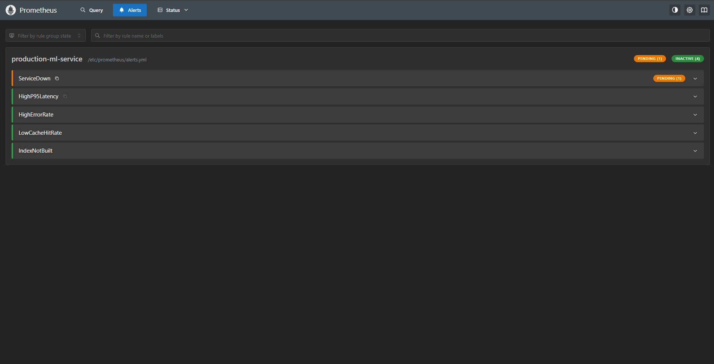

**Alert pending — IndexNotBuilt:**

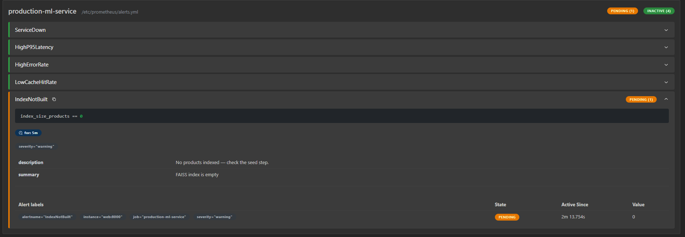

**Alert firing — IndexNotBuilt:**

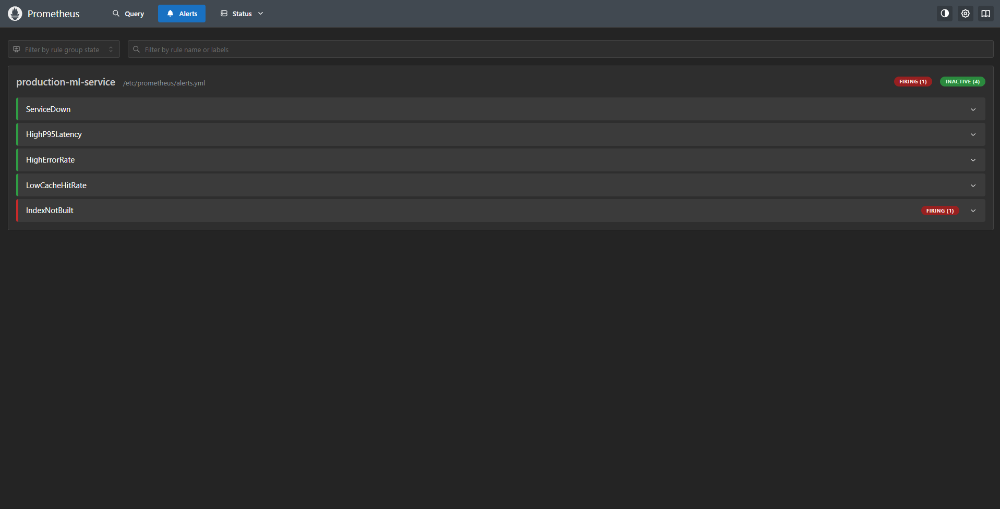

**All alerts resolved:**

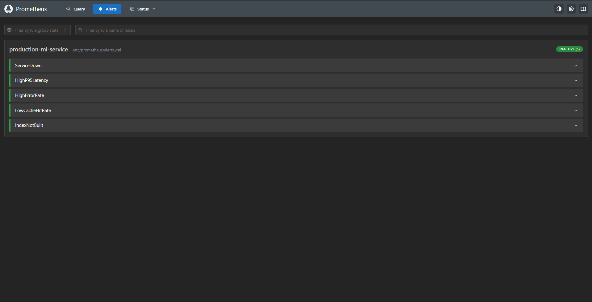

---

## Architecture

```
                   ┌──────────────────┐
                   │     FastAPI      │
                   │   (app/main.py)  │
                   └────────┬─────────┘
                            │
        ┌───────────────────┼───────────────────┐
        ▼                   ▼                   ▼
  ┌───────────┐     ┌──────────────┐     ┌─────────────┐
  │  /api/    │     │   /api/      │     │   /api/     │
  │ recommend │     │ conversation │     │ description │
  └─────┬─────┘     └──────┬───────┘     └──────┬──────┘
        │                  │                    │
        ▼                  ▼                    ▼
  ┌───────────┐     ┌──────────────┐     ┌─────────────┐
  │  FAISS    │     │  Rec Engine  │     │ LLM Client  │
  │  + S-T    │◀────│  + LLM       │     │ (mock/Groq/ │
  │           │     │              │     │  llama.cpp) │
  └─────┬─────┘     └──────────────┘     └─────────────┘
        │
        ▼
  ┌─────────────────────────────────────────────────────┐
  │   Redis (cache)  │  MongoDB (store)  │  Prometheus  │
  └─────────────────────────────────────────────────────┘
```

---

## Getting Started

### Prerequisites

- Docker Desktop (recommended), **or**
- Python 3.10 + MongoDB + Redis for manual setup

### Full stack via Docker Compose

```bash
git clone https://github.com/prashanth1276/production-ml-service.git
cd production-ml-service

# Create the Grafana admin password
mkdir -p secrets
echo "your-strong-password" > secrets/grafana_admin_password.txt

docker compose up --build
```

This starts five containers:

- **web** — FastAPI app at http://localhost:8000
- **mongo** — MongoDB at localhost:27017
- **redis** — Redis at localhost:6379
- **prometheus** — metrics scraper at http://localhost:9090
- **grafana** — dashboards at http://localhost:3000 (admin / password from `secrets/`)

Seed the catalog and verify:

```bash
docker compose exec web python scripts/seed_db.py

curl http://localhost:8000/health
curl http://localhost:8000/ready
curl "http://localhost:8000/api/recommendations?query=running+shoes&top_k=5"
```

### Manual setup

```bash
# Backing services
docker run -d -p 27017:27017 --name retail-mongo mongo:7
docker run -d -p 6379:6379 --name retail-redis redis:7-alpine

# Python environment
py -3.10 -m venv .venv
.venv\Scripts\activate                # Windows
# source .venv/bin/activate           # macOS/Linux

pip install -r requirements.txt

# Seed and run
python scripts/seed_db.py
uvicorn app.main:app --reload --port 8000
```

---

## API Endpoints

| Method | Path | Auth | Description |
|---|---|---|---|
| `GET` | `/` | Public | Welcome message + version info |
| `GET` | `/health` | Public | Liveness probe |
| `GET` | `/ready` | Public | Readiness probe (MongoDB + Redis) |
| `GET` | `/metrics` | Public | Prometheus metrics |
| `GET` | `/docs` | Public | Interactive API docs (Swagger UI) |
| `GET` | `/api/recommendations?query=...&top_k=5` | Protected | Semantic product recommendations |
| `POST` | `/api/conversation` | Protected | Conversational shopping response |
| `GET` | `/api/description?product_id=...` | Protected | AI-generated product description |

**Auth:** disabled by default. Enable via `API_KEY_ENABLED=true` in `.env`. When
enabled, `/api/*` requires an `X-API-Key` header matching `API_KEY`.

---

## LLM Backend Options

The service is backend-agnostic. Any server implementing the OpenAI
`/v1/chat/completions` API works without code changes.

| Backend | Config | Resources | Use case |
|---|---|---|---|
| **Mock** (default) | `LLM_BACKEND=mock` | None | CI, tests, offline development |
| **Groq cloud** | `openai_compatible` + Groq URL | None local | Real responses, free tier |
| **llama.cpp** (self-hosted) | `openai_compatible` + llama.cpp URL | ~1 GB RAM | Local CPU inference |
| **vLLM** (self-hosted) | `openai_compatible` + vLLM URL | 12+ GB VRAM | Production GPU serving |

**Recommended free-tier cloud option (verified end-to-end):**

```env
LLM_BACKEND=openai_compatible
LLM_API_URL=https://api.groq.com/openai/v1
LLM_MODEL=openai/gpt-oss-20b
LLM_API_KEY=gsk_your_key_here
```

Get a key at https://console.groq.com/keys (no credit card required).

See [`docs/LLM_BACKEND.md`](docs/LLM_BACKEND.md) for detailed setup, hardware
guidance, and a decision tree.

---

## Evaluation Harness

Three standalone scripts in `eval/`:

```bash
python -m eval.retrieval_eval    # NDCG@5, Precision@5, Recall@5, MRR
python -m eval.latency_eval      # mean / p50 / p95 / p99 per endpoint
python -m eval.cache_eval        # cold vs warm path
```

Outputs are written to `results/*.csv`.

---

## Testing

```bash
docker compose exec web sh -c "PYTHONPATH=/app pytest -q"
```

12 tests covering:

- API routes (health, readiness, recommendations, chat, description)
- Recommendation engine (index building, top-k retrieval, empty catalog handling)
- Mock LLM backend (deterministic CI-friendly responses)

CI runs on every push via GitHub Actions — test job, Docker build job, and a
full 5-container Compose smoke test.

---

## Proof

Screenshots captured from a live Docker Compose stack running locally. All
five containers running: web, mongo, redis, prometheus, grafana.

### Stack startup

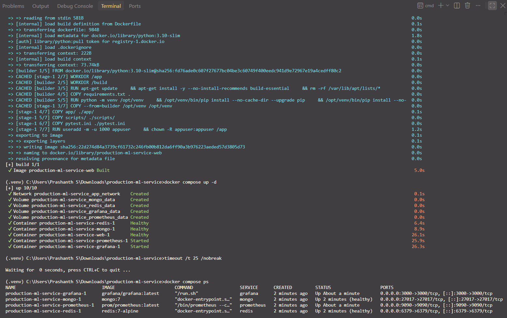

### Database seeded


### Live API responses

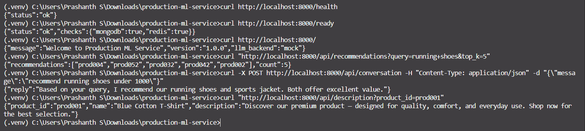

### Test suite passes

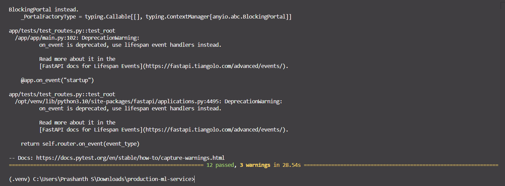

### Prometheus targets UP

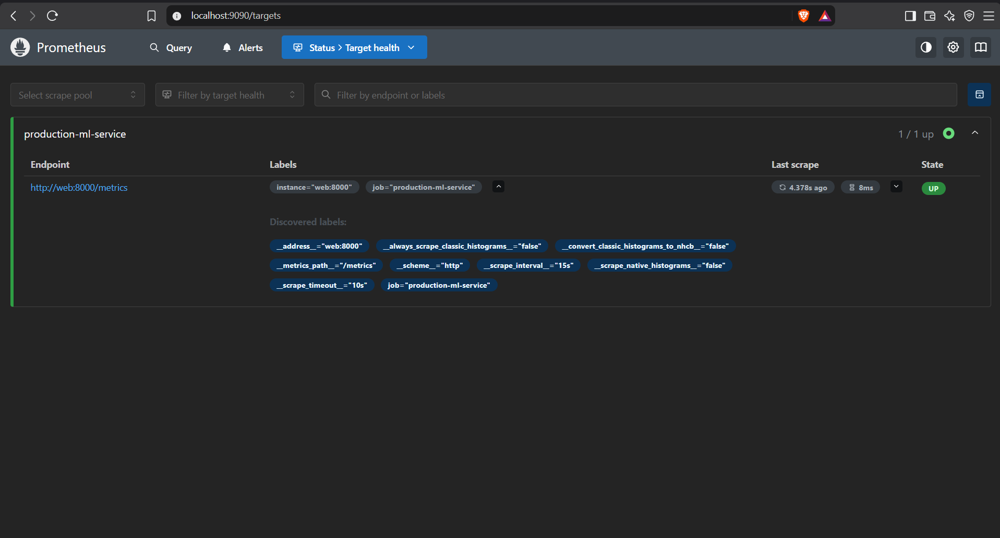

### Prometheus metric query

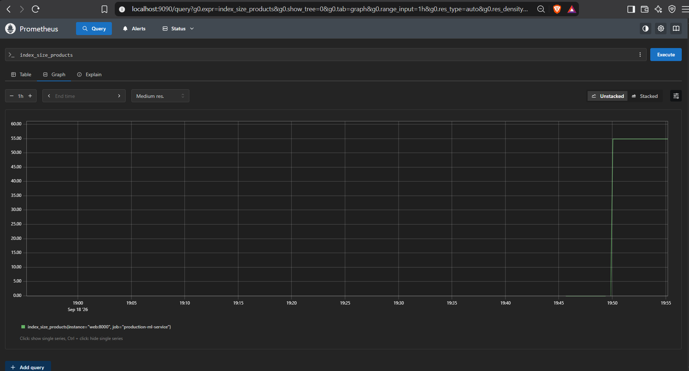

### Grafana dashboard with live data

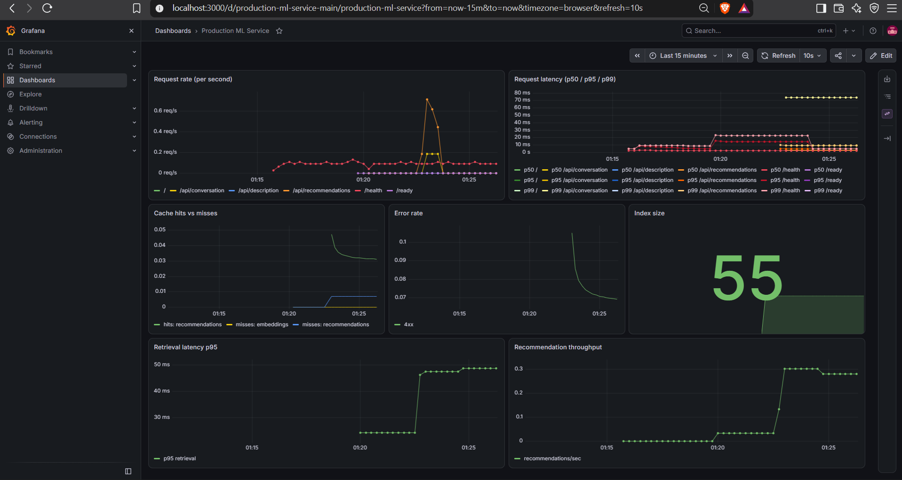

### Redis cache active

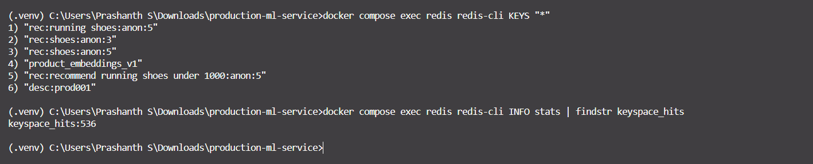

### MongoDB contents

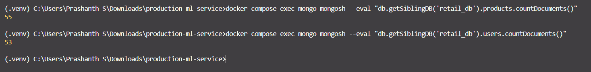

### Real LLM response via Groq

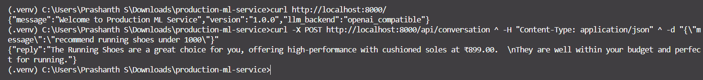

### CI pipeline green

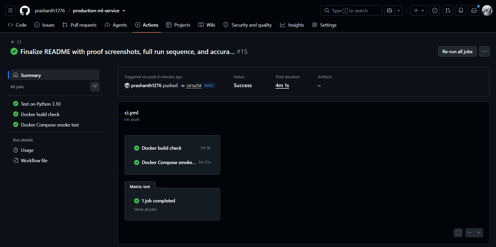

### Alert lifecycle — pending


### Alert lifecycle — firing


### All alerts resolved


---

## Full Run — From Scratch to Verified

Copy-paste sequence to run and verify the entire stack.

```bash
# ---- 1. Stop and clean ----
docker compose down
docker compose down -v

# ---- 2. Build the app image ----
docker compose build web

# ---- 3. Start the full stack ----
docker compose up -d
timeout /t 20

# ---- 4. Confirm all containers healthy ----
docker compose ps

# ---- 5. Seed the database ----
docker compose exec web python scripts/seed_db.py

# ---- 6. Verify endpoints ----
curl http://localhost:8000/health
curl http://localhost:8000/ready
curl http://localhost:8000/
curl "http://localhost:8000/api/recommendations?query=running+shoes&top_k=5"
curl -X POST http://localhost:8000/api/conversation -H "Content-Type: application/json" -d "{\"message\":\"recommend running shoes under 1000\"}"
curl "http://localhost:8000/api/description?product_id=prod001"
curl http://localhost:8000/metrics | findstr "index_size recommendations_served"

# ---- 7. Run the test suite ----
docker compose exec web sh -c "PYTHONPATH=/app pytest -q"

# ---- 8. Check Redis ----
docker compose exec redis redis-cli ping

# ---- 9. Check MongoDB ----
docker compose exec mongo mongosh --eval "db.getSiblingDB('retail_db').products.countDocuments()"

# ---- 10. Observability ----
# Prometheus:  http://localhost:9090/targets
# Grafana:     http://localhost:3000  (admin / password from secrets/)
# Metrics:     http://localhost:8000/metrics

# ---- 11. Load test (clean throughput) ----
# Set RATE_LIMIT_ENABLED=false in .env first, then recreate web:
docker compose up -d web
timeout /t 15

locust -f load_tests/locustfile.py --headless -u 20 -r 5 -t 60s \
  --host http://localhost:8000 \
  --csv=results/load_test --html=results/load_test.html

# Reset: RATE_LIMIT_ENABLED=true in .env
docker compose up -d web

# ---- 12. Verify Prometheus alerts fire ----
docker compose stop web
timeout /t 90
# Open http://localhost:9090/alerts → ServiceDown FIRING
docker compose start web
timeout /t 60
# Refresh → back to INACTIVE

# ---- 13. Teardown ----
docker compose down
docker compose down -v   # also removes volumes
```

### Enabling the real LLM (Groq)

```bash
# 1. Get a key: https://console.groq.com/keys
# 2. Edit .env:
#      LLM_BACKEND=openai_compatible
#      LLM_MODEL=openai/gpt-oss-20b
#      LLM_API_KEY=gsk_your_key_here
# 3. Recreate the web container:
docker compose up -d web
timeout /t 15

# 4. Verify the backend switched:
curl http://localhost:8000/
# Expected: "llm_backend":"openai_compatible"

# 5. Test the real LLM:
curl -X POST http://localhost:8000/api/conversation ^
  -H "Content-Type: application/json" ^
  -d "{\"message\":\"recommend running shoes under 1000\"}"

# 6. Reset to safe defaults:
#      LLM_BACKEND=mock
#      LLM_API_KEY=
docker compose up -d web
```

---

## Design Decisions

**Why FAISS over a managed vector DB?**
FAISS runs in-process with no external service — fast local development and
hermetic CI. For production scale, swap for Pinecone / Weaviate / Qdrant. The
`get_recommendations` interface stays the same.

**Why a mock LLM backend by default?**
Deterministic tests and hermetic CI. Real backends swap in via `LLM_BACKEND`
without any code changes.

**Why CPU-only PyTorch?**
`sentence-transformers` pulls PyTorch, whose default wheel includes ~5 GB of
CUDA packages. Since the app runs on CPU, `requirements.txt` pins
`torch==2.4.1+cpu`, reducing image size from ~7 GB to ~1.5 GB and CI build time
from ~17 min to ~5 min.

**Why structured logging?**
`print()` doesn't scale. JSON logs are parseable by ELK / Datadog and include a
request ID for cross-service tracing.

**Why Prometheus?**
De-facto standard for cloud-native metrics. The `/metrics` endpoint exposes
`http_requests_total`, `http_request_duration_seconds`, `cache_hits_total`,
`cache_misses_total`, and `index_size_products`.

**Why Prometheus alert rules?**
Dashboards show state, alerts drive action. `monitoring/alerts.yml` defines five
rules covering service availability, p95 latency, error rate, cache effectiveness,
and index health. These are the same metric patterns production on-call rotations
watch.

**Why API-key auth as middleware?**
Keeps auth orthogonal to routes. Toggle via `API_KEY_ENABLED` — off for local
development and CI, on for any real deployment. `/health`, `/ready`,
`/metrics`, and `/docs` stay public.

---

## Deployment

See [`docs/DEPLOYMENT.md`](docs/DEPLOYMENT.md) for a full guide covering Google
Cloud Run, AWS ECS Fargate, and Railway, including managed MongoDB / Redis and
secrets management.

**No live deployment is active** — this is a portfolio project. The Docker
Compose stack mirrors the production architecture; only the hosting differs.

---

## Repository Structure

```
production-ml-service/
├── .github/
│   └── workflows/
│       └── ci.yml
│
├── app/
│   ├── main.py
│   ├── middleware/
│   │   ├── __init__.py
│   │   └── auth.py
│   ├── routes/
│   │   ├── chat.py
│   │   ├── describe.py
│   │   └── recommend.py
│   ├── services/
│   │   ├── chatbot_engine.py
│   │   ├── genai_writer.py
│   │   ├── hybrid_engine.py
│   │   └── rec_engine.py
│   ├── tests/
│   │   ├── conftest.py
│   │   ├── test_rec_engine.py
│   │   └── test_routes.py
│   └── utils/
│       ├── cache.py
│       ├── config.py
│       ├── db.py
│       ├── llm_client.py
│       ├── logging_config.py
│       ├── metrics.py
│       ├── products.json
│       └── users.json
│
├── docs/
│   ├── DEPLOYMENT.md
│   ├── LLM_BACKEND.md
│   └── screenshots/
│       ├── 01_compose_up.png
│       ├── 02_seed.png
│       ├── 03_endpoints.png
│       ├── 04_tests.png
│       ├── 05_prometheus_targets.png
│       ├── 06_prometheus_query.png
│       ├── 07_grafana_dashboard.png
│       ├── 08_redis.png
│       ├── 09_mongo.png
│       ├── 10_real_llm.png
│       ├── 11_ci_passing.png
│       ├── 12_alert_servicedown_pending.png
│       ├── 13_alert_index_pending.png
│       ├── 14_alert_index_firing.png
│       └── 15_alerts_all_inactive.png
│
├── eval/
│   ├── cache_eval.py
│   ├── latency_eval.py
│   ├── metrics.py
│   ├── retrieval_ablation.py
│   ├── retrieval_eval.py
│   └── test_queries.py
│
├── load_tests/
│   └── locustfile.py
│
├── monitoring/
│   ├── alerts.yml
│   ├── prometheus.yml
│   └── grafana/
│       ├── dashboards/
│       │   └── main.json
│       └── provisioning/
│           ├── dashboards/
│           │   └── dashboard.yml
│           └── datasources/
│               └── prometheus.yml
│
├── results/
│   └── .gitkeep
│
├── scripts/
│   └── seed_db.py
│
├── secrets/
│   └── .gitkeep
│
├── .dockerignore
├── .env.example
├── .gitignore
├── docker-compose.yml
├── Dockerfile
├── LICENSE
├── pytest.ini
├── README.md
├── requirements.txt
└── ruff.toml
```

---

## Limitations

- **Small catalog:** 55 products, 53 users. Scaling to production would require
  a sharded vector index or a dedicated vector database.
- **Mock LLM in CI:** The evaluation harness uses a mock LLM. Real LLM latency
  is 200–500 ms via Groq, or 500–2000 ms via self-hosted llama.cpp.
- **No MongoDB authentication in local dev:** Production requires MongoDB auth
  + IP allowlisting (see `docs/DEPLOYMENT.md`).
- **CPU-only in CI:** All tests and evaluation runs use CPU. Local deployments
  may use an NVIDIA GPU via `nvidia-container-toolkit`.
- **Single-node Redis:** No clustering or persistence. Redis is used as a pure
  cache; restarts clear it.
- **Rate limiting is per-IP:** Suitable for development and single-tenant
  deployment. Per-user rate limiting requires API-key integration with the
  limiter (future work).
- **Rate limiter contention under heavy concurrency:** `fastapi-limiter`
  acquires a Redis connection per request. Under 50+ concurrent users on a
  single-worker deployment, some requests queue on connection acquisition and
  exceed 1 s p95. Production would use a connection pool or a per-worker
  limiter cache.

---

## Future Work

- **Gated user-context injection:** Augment queries with user history only when
  the query semantically matches stored preferences. The retrieval evaluation
  showed naive context injection degrades NDCG by 22 points.
- **Per-user rate limiting:** Tie rate limits to the API key instead of IP.
- **Alert routing:** Wire `monitoring/alerts.yml` into Alertmanager with a real
  receiver (Slack, PagerDuty).
- **Managed storage for deployment:** Wire MongoDB Atlas + Upstash Redis into
  the Cloud Run deploy path.
- **Model evaluation benchmark:** Compare mock vs. Groq vs. self-hosted
  llama.cpp on a fixed set of conversational queries.

---

## License

MIT — see [LICENSE](LICENSE).